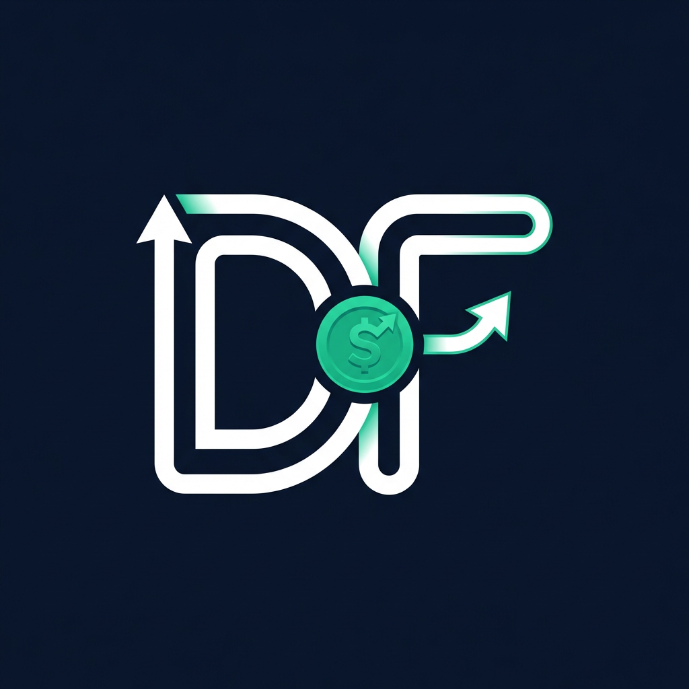

<p align="center">
  
</p>

<h1 align="center">Dough Flow</h1>

<p align="center">A personal finance tracker to manage your money, pay off debt, and hit your savings goals.</p>

---

## What it does

- **Dashboard** — See your net worth, monthly income vs. expenses, top spending categories, and account balances at a glance
- **Accounts** — Track checking, savings, credit, investment, and loan accounts across institutions
- **Transactions** — Log income, expenses, and transfers with categories and search/filter
- **Reports** — Monthly breakdowns, income vs. expense trends, and category comparisons
- **Debt Payoff** — Track debts with interest rates, simulate payoff with extra payments, and view amortization schedules
- **Budgets & Goals** — Set monthly category budgets and savings goals with progress tracking
- **CSV Import** — Import transactions from bank exports with column mapping and duplicate detection
- **Currency Preference** — Choose from 50+ currencies; formatting applies across all pages

## Tech stack

| Layer    | Tech                                      |
| -------- | ----------------------------------------- |
| Frontend | React, TypeScript, Vite, TailwindCSS      |
| Backend  | FastAPI (async), SQLAlchemy 2.0, Pydantic  |
| Database | PostgreSQL (asyncpg)                       |
| Auth     | JWT (bcrypt + HS256)                       |

## Getting started

### Prerequisites

- Docker & Docker Compose
- Node.js 18+
- Python 3.12+ & Poetry

### Run with Docker

```bash
cp .env.example .env   # configure DATABASE_URL, SECRET_KEY, etc.
docker compose up
```

This starts PostgreSQL (5432), the API (8000), and the frontend (3000).

### Run locally

```bash
# Backend
cd backend
poetry install
poetry run alembic upgrade head
poetry run uvicorn app.main:app --reload --port 8000

# Frontend
cd frontend
npm install
npm run dev
```

### Run tests

```bash
cd backend
poetry run pytest tests/
```

## License

MIT
